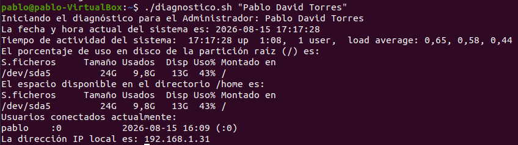
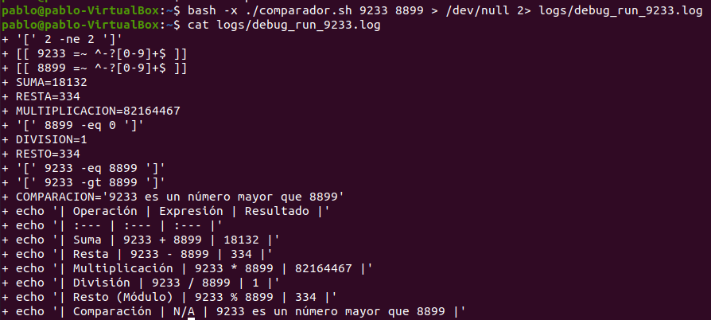

# Trabajo Práctico 1
**Alumno:** Pablo Torres
**Legajo:** 9233

## Descripción
Este repositorio contiene los scripts de bash (entorno, diagnóstico y comparación) desarrollados para la materia, junto con los archivos de registro (logs) que evidencian su correcta ejecución.

### 1. Script de Entorno

### 2. Script de Diagnóstico

### 3. Script Comparador (Modo Debug)

