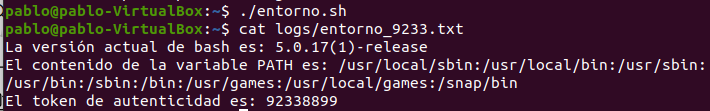
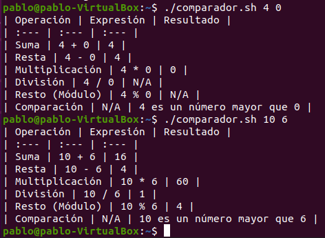

# Trabajo Práctico 1
**Alumno:** Pablo Torres
**Legajo:** 9233

## Descripción
Este repositorio contiene los scripts de bash (entorno, diagnóstico y comparación) desarrollados para la materia, junto con los archivos de registro (logs) que evidencian su correcta ejecución y las capturas de ejecución de los mismos.

### 1. Ejecución de script de Entorno

### 2. Ejecución de script de Diagnóstico

### 3. Ejecución de script Comparador

